# Project: Level AI Academy

## Project Overview
Level AI Academy is a comprehensive AI learning platform built on Frappe LMS for charities, social enterprises, and purpose-driven businesses. This learning management system provides AI-focused courses and training materials aligned with the UK Government AI Playbook framework.

## Tech Stack
- **Framework**: Frappe Framework (Python backend, Vue.js frontend)
- **Database**: MariaDB 10.8
- **Cache**: Redis
- **Development**: Docker-based development environment

## Development Setup

### Prerequisites
- Docker and Docker Compose installed
- Git

### Running the Application
1. Start Docker containers: `docker compose up -d`
2. Access the application at: http://localhost:8000/lms
3. Login credentials:
   - Username: Administrator
   - Password: admin

### Stopping the Application
- Stop containers: `docker compose down`
- Stop and remove volumes: `docker compose down -v`

## Project Structure
- `/frontend/` - Vue.js frontend application
- `/lms/` - Main LMS Python module
- `/docker/` - Docker configuration files
- `docker-compose.yml` - Docker compose configuration
- `init.sh` - Initialization script for Frappe bench

## Level AI Academy 5-Level Learning Framework
*Aligned with UK Government AI Playbook for the Civil Service*

### **LEVEL 1: AI FOUNDATIONS**
*"Understanding AI: From Buzzword to Breakthrough"*
- **Duration:** 2-4 weeks (8-12 hours total)
- **Target:** Complete beginners, all staff levels
- **Focus:** AI demystification, ethics, basic capabilities and limitations
- **Outcome:** AI literacy and readiness for practical applications

### **LEVEL 2: AI USER COMPETENCY**
*"From Observer to Operator: Mastering AI Tools"*
- **Duration:** 4-6 weeks (16-20 hours total)
- **Target:** Staff who will use AI tools regularly
- **Focus:** Hands-on tool mastery, prompt engineering, quality control
- **Outcome:** Confident daily AI tool usage with quality output

### **LEVEL 3: AI IMPLEMENTATION PROFESSIONAL**
*"Building Solutions: From Concept to Reality"*
- **Duration:** 6-8 weeks (24-32 hours total)
- **Target:** Technical staff, project managers, digital leads
- **Focus:** AI project management, data preparation, system integration
- **Outcome:** Ability to lead AI implementation projects successfully

### **LEVEL 4: AI STRATEGIC LEADERSHIP**
*"Leading the Revolution: AI Strategy for Purpose-Driven Leaders"*
- **Duration:** 4-6 weeks (16-20 hours total)
- **Target:** Senior managers, trustees, executive directors
- **Focus:** AI strategy, governance, organisational transformation
- **Outcome:** Strategic AI leadership and organisational change capability

### **LEVEL 5: AI INNOVATION AND ADVANCED PRACTICE**
*"Pioneering Impact: Leading AI Innovation for Social Good"*
- **Duration:** 6-8 weeks (24-32 hours total)
- **Target:** Innovation leads, advanced practitioners, sector pioneers
- **Focus:** Cutting-edge applications, research, sector transformation
- **Outcome:** AI innovation leadership and sector advancement capability

## Key Customization Areas for Level AI Academy

### 1. Branding and Design
- **Logo**: Level.ai scales/friendly face design
- **Colors**: Level.ai brand palette
  - Earthstone: #293f3b (primary text and headers)
  - Sunshine Yellow: #feda00 (accent highlights)
  - Terra Green: #296b42 (success and progress indicators)
  - Coral: #ff7f7a (buttons and CTAs with Earthstone text)
- **Typography**: DM Sans (body), Concert One (headings)
- **Site Title**: "Level AI Academy" in LMS Settings

### 2. Course Structure Implementation
- **Level-based progression**: Sequential 5-level framework
- **Competency-based advancement**: Skills verification before progression
- **Adaptive learning pathways**: Personalised content based on role and organisation
- **Cross-level resource access**: Advanced learners can access higher-level materials
- **Portfolio building**: Continuous collection of learning artifacts

### 3. Frontend Customization
- **Interactive assessments**: Scenario-based learning with charity data
- **Community features**: Study groups, mentorship marketplace, sector-specific communities
- **Progress tracking**: Visual competency dashboards, achievement badges
- **Mobile-first design**: Responsive interface for busy charity professionals
- Main app entry: `/frontend/src/App.vue`
- Course components: `/frontend/src/components/`
- Pages: `/frontend/src/pages/`

### 4. Backend Customization
- **Learning analytics**: Detailed progress tracking and predictive modelling
- **Integration capabilities**: CRM, HR, and operational system connections
- **Custom DocTypes**: Charity-specific data models and workflows
- **API endpoints**: `/lms/lms/api.py`
- **DocTypes (data models)**: `/lms/lms/doctype/`
- Custom business logic in respective Python files

### 5. Advanced Platform Features
- **AI-powered content recommendations**: Based on learner role and progress
- **Real-time collaboration tools**: For group projects and peer learning
- **Expert network integration**: Connection to mentors and specialists
- **Comprehensive analytics**: Individual, organisational, and sector-wide insights
- **Multi-format content support**: Video, interactive simulations, resources

## Development Guidelines
- Follow Frappe Framework conventions
- Use the bench command for Frappe-specific operations
- Frontend changes require rebuilding: `docker compose exec lms-frappe-1 bench build --app lms`
- Clear cache after backend changes: `docker compose exec lms-frappe-1 bench --site lms.localhost clear-cache`
- Implement Level.ai brand guidelines consistently across all interfaces
- Ensure accessibility compliance (WCAG 2.1 AA)
- Maintain mobile-first responsive design principles

## Testing Commands
- Run Python tests: `docker compose exec lms-frappe-1 bench --site lms.localhost run-tests --app lms`
- Access Frappe console: `docker compose exec lms-frappe-1 bench --site lms.localhost console`
- Test course progression: Verify level-based advancement logic
- Validate assessment systems: Ensure competency-based verification works

## Common Tasks
- Create new DocType: Use Frappe UI or `bench new-doctype`
- Add new page: Create Vue component in `/frontend/src/pages/` and add route
- Modify email templates: Edit files in `/lms/templates/emails/`
- Update course content: Use structured video scripts and interactive elements
- Configure learning pathways: Set up level progression and prerequisites
- Implement brand elements: Apply Level.ai design system throughout

## Security and Privacy
- **GDPR compliance by design**: Built-in data protection with granular consent management
- **Charity-specific privacy controls**: Additional protections for beneficiary data
- **Role-based access control**: Sophisticated permissions reflecting charity structures
- **Enterprise-grade security**: SSL/TLS encryption, secure authentication, regular audits
- **Ethical AI framework**: Built-in guidelines and bias detection systems

## Integration Capabilities
- **CRM Systems**: Salesforce Nonprofit Cloud, Blackbaud CRM, CiviCRM
- **HR Platforms**: BambooHR, Workday HCM, professional development tracking
- **Financial Systems**: Xero, QuickBooks, grant management platforms
- **Project Management**: Asana, Monday.com, volunteer management systems
- **Authentication**: Single sign-on, multi-factor authentication options

## Production Deployment Architecture

### Azure Reference Architecture

```mermaid
graph TB
    subgraph "Azure Public Cloud - UK South"
        subgraph "Network Layer"
            AG[Application Gateway v2 + WAF]
            VN[Virtual Network - 10.0.0.0/16]
            PE[Private Endpoints]
        end
        
        subgraph "Compute Layer"
            VMSS[VM Scale Set<br/>Ubuntu 22.04 LTS<br/>Docker Compose]
            NGINX[Nginx Reverse Proxy]
        end
        
        subgraph "Data Layer"
            MARIA[Azure Database for MariaDB<br/>Flexible Server - GP Tier]
            REDIS[Azure Cache for Redis<br/>C1→C3 Standard]
            BLOB[Azure Blob Storage<br/>Private + Public Containers]
        end
        
        subgraph "Security & Identity"
            KV[Key Vault<br/>TLS Certificates]
            EID[Entra ID<br/>SSO + Conditional Access]
        end
        
        subgraph "Monitoring"
            MON[Azure Monitor<br/>Log Analytics]
            AI[Application Insights<br/>OpenTelemetry]
        end
    end
    
    Users --> AG
    AG --> NGINX
    NGINX --> VMSS
    VMSS --> MARIA
    VMSS --> REDIS
    VMSS --> BLOB
    VMSS --> AI
    EID --> VMSS
```



### Infrastructure Components

#### **Compute Infrastructure**
- **VM Scale Set**: Ubuntu 22.04 LTS running Docker Compose-managed frappe-bench stack
- **Instance Size**: Standard_D2s_v3 (2 vCPU, 8GB RAM) minimum, scale to Standard_D4s_v3 under load
- **Auto-scaling**: 2-10 instances based on CPU >70% or memory >80%
- **Load Balancer**: Application Gateway v2 with SSL termination and WAF protection

#### **Database & Cache**
- **Azure Database for MariaDB Flexible Server**
  - General Purpose tier: 2-8 vCores, 100GB-1TB storage
  - Private networking only, no public endpoints
  - Automated backups with 35-day retention
  - Read replicas for reporting workloads
- **Azure Cache for Redis**
  - Standard C1 (1GB) → C3 (6GB) based on user growth
  - Used for Frappe queues, cache, and Socket.IO events
  - Private endpoint connection only

#### **Storage Strategy**
- **Azure Blob Storage**: Hot tier for active course content, Cool tier for archived materials
- **Private Container**: User uploads, sensitive documents, backup files
- **Public Container**: Static assets, course videos, downloadable resources
- **Azure CDN**: Global content delivery for video streaming and static assets
- **Backup Strategy**: Azure Blob lifecycle policies with immutable storage for compliance

#### **Networking & Security**
- **Virtual Network**: 10.0.0.0/16 with private subnets for all resources
- **Application Gateway**: TLS 1.3, custom domain with Key Vault certificates
- **Private Endpoints**: All database and storage connections use private networking
- **Network Security Groups**: Restrictive rules, only required ports open
- **Web Application Firewall**: OWASP Top 10 protection with custom rules

## Infrastructure as Code

### Terraform Structure
```
/infra/
├── terraform/
│   ├── environments/
│   │   ├── dev/
│   │   ├── staging/
│   │   └── prod/
│   ├── modules/
│   │   ├── networking/
│   │   ├── compute/
│   │   ├── database/
│   │   ├── storage/
│   │   └── monitoring/
│   └── shared/
├── scripts/
│   ├── deploy.sh
│   ├── backup.sh
│   └── rollback.sh
└── docs/
    ├── runbook.md
    ├── disaster-recovery.md
    └── cost-optimization.md
```

### Environment Configuration
```hcl
# prod.tfvars example
environment = "prod"
location = "UK South"
paired_region = "UK West"

# Compute
vm_sku = "Standard_D4s_v3"
vm_count_min = 2
vm_count_max = 10
auto_scale_cpu_threshold = 70

# Database
mariadb_sku = "GP_Standard_D4s_v3"
mariadb_storage_gb = 500
mariadb_backup_retention_days = 35

# Cache
redis_sku = "C3"
redis_capacity = 6

# Budget
monthly_budget_gbp = 800
cost_alert_threshold = 80
```

## CI/CD Pipeline

### GitHub Actions Workflows

#### **Build & Deploy Pipeline**
```yaml
# .github/workflows/deploy.yml
name: Deploy Level AI Academy

on:
  push:
    branches: [main, develop]
  workflow_dispatch:

jobs:
  build:
    runs-on: ubuntu-latest
    steps:
      - name: Build Frappe Docker Image
        run: |
          docker build -t levelai/academy:${{ github.sha }} .
          docker push levelai/academy:${{ github.sha }}
  
  deploy:
    needs: build
    runs-on: ubuntu-latest
    environment: production
    steps:
      - name: Deploy to Azure VMSS
        run: |
          az vmss update --name levelai-academy-vmss \
            --resource-group levelai-academy-prod \
            --set virtualMachineProfile.storageProfile.imageReference.id=$IMAGE_ID
          
      - name: Run Database Migrations
        run: |
          docker exec frappe-container bench --site academy.level.ai migrate
          
      - name: Health Check
        run: |
          curl -f https://academy.level.ai/api/method/lms.api.get_courses
```

#### **Infrastructure Pipeline**
```yaml
# .github/workflows/infrastructure.yml
name: Infrastructure Deployment

on:
  push:
    paths: ['infra/**']
    branches: [main]

jobs:
  terraform:
    runs-on: ubuntu-latest
    steps:
      - name: Terraform Plan
        run: |
          cd infra/terraform/environments/prod
          terraform plan -var-file=prod.tfvars
          
      - name: Terraform Apply
        if: github.ref == 'refs/heads/main'
        run: |
          cd infra/terraform/environments/prod
          terraform apply -auto-approve -var-file=prod.tfvars
```

## Security & Compliance

### Authentication & Authorization
- **Primary Identity Provider**: Microsoft Entra ID (Azure AD)
- **Secondary Provider**: Google Workspace (optional)
- **SSO Integration**: OIDC/SAML with Frappe's social_login_key DocTypes
- **Conditional Access**: Location-based, device compliance, MFA requirements
- **Role Mapping**:
  - `Staff` → Full course creation and user management
  - `Volunteer` → Limited course management and mentoring
  - `Learner` → Course enrollment and progress tracking
  - `Guest` → Public course preview only

### Data Protection & Privacy
- **GDPR Compliance**: Built-in data protection with granular consent management
- **Data Residency**: All data stored in UK South region only
- **Data Classification**: 
  - Public: Course marketing materials, public courses
  - Internal: User profiles, course progress, certificates
  - Confidential: Personal data, assessment results, analytics
- **Encryption**:
  - At Rest: Azure Storage Service Encryption (SSE) with customer-managed keys
  - In Transit: TLS 1.3 for all connections
  - Application: Frappe built-in encryption for sensitive fields

### Security Controls
- **Network Security**: Private endpoints, no public database access
- **Web Application Firewall**: OWASP Top 10 + custom charity sector rules
- **Vulnerability Management**: Weekly OS updates, container image scanning
- **Access Controls**: Role-based permissions, least privilege principle
- **Audit Logging**: All user actions logged to Azure Monitor
- **Incident Response**: Automated alerting for security events

## Monitoring & Observability

### Application Monitoring
- **Application Insights**: Python and Node.js tracing with OpenTelemetry
- **Performance Metrics**: Response times, throughput, error rates
- **User Analytics**: Course completion rates, learning paths, engagement metrics
- **Custom Dashboards**: Real-time learning analytics for administrators

### Infrastructure Monitoring
- **Azure Monitor**: VM performance, network metrics, storage usage
- **Log Analytics**: Centralized logging from all components
- **Alerting**: Proactive notifications for performance degradation
- **Cost Management**: Budget alerts and optimization recommendations

### Key Performance Indicators
- **Availability**: 99.9% uptime target
- **Performance**: <2s page load time, <1.5s API response time
- **Scalability**: Support 500 concurrent users with <60s auto-scale response
- **Error Rate**: <1% 4xx/5xx errors under normal load

## Backup & Disaster Recovery

### Backup Strategy
- **Database Backups**:
  - Automated daily backups with 35-day retention
  - Point-in-time recovery capability
  - Cross-region backup replication to UK West
- **File Storage Backups**:
  - Azure Blob storage with geo-redundant replication
  - Immutable blob storage for compliance requirements
  - Lifecycle policies for cost optimization
- **Application Backups**:
  - Daily `bench backup --with-files` stored in Azure Blob
  - Version-controlled infrastructure state files

### Disaster Recovery
- **Recovery Time Objective (RTO)**: 4 hours
- **Recovery Point Objective (RPO)**: 1 hour
- **DR Strategy**: Cold standby in UK West region
- **Failover Process**:
  1. Restore database from latest backup
  2. Deploy application to DR region VMSS
  3. Update DNS to point to DR environment
  4. Validate system functionality
- **DR Testing**: Monthly disaster recovery drills

## Cost Optimization

### Budget Planning
- **Development Environment**: £150/month
- **Staging Environment**: £250/month  
- **Production Environment**: £400-800/month (scales with usage)
- **Total Annual Cost**: £9,600-14,400 (including DR)

### Cost Breakdown (Production)
| Component | Monthly Cost (GBP) | Scaling Notes |
|-----------|-------------------|---------------|
| VM Scale Set (2x D4s_v3) | £180 | Auto-scales to 10x under load |
| MariaDB Flexible Server | £120 | GP_Standard_D4s_v3 + 500GB |
| Redis Cache (C3) | £85 | 6GB, can upgrade to P1 if needed |
| Azure Blob Storage | £45 | 1TB hot + 5TB cool + egress |
| Application Gateway | £60 | Standard_v2 + WAF |
| Monitoring & Logs | £40 | Log Analytics + App Insights |
| Backup & DR | £90 | Cross-region replication |
| **Total** | **£620** | **Peak load estimate** |

### Optimization Strategies
- **Reserved Instances**: 40% savings on compute with 1-year commitment
- **Storage Tiers**: Automatic transition to cool/archive based on access patterns
- **CDN Optimization**: Efficient caching for global content delivery
- **Auto-scaling**: Automatic scale-down during low usage periods
- **Resource Tagging**: Detailed cost tracking and allocation

## Operations Runbook

### Day 0: Initial Deployment
1. **Infrastructure Provisioning**
   ```bash
   cd infra/terraform/environments/prod
   terraform init
   terraform plan -var-file=prod.tfvars
   terraform apply -var-file=prod.tfvars
   ```

2. **Application Deployment**
   ```bash
   # Deploy Frappe LMS
   gh workflow run deploy.yml --ref main
   
   # Verify deployment
   curl -f https://academy.level.ai/api/method/ping
   ```

3. **Initial Configuration**
   - Configure Entra ID SSO
   - Import Level AI Academy course structure
   - Set up monitoring dashboards
   - Test backup and restore procedures

### Day 1: Operations
- **Health Checks**: Automated monitoring of all critical services
- **Performance Monitoring**: Real-time dashboards for system and application metrics
- **Security Monitoring**: Continuous scanning for vulnerabilities and threats
- **User Support**: Help desk integration and user feedback collection

### Day 2: Maintenance & Optimization
- **Capacity Planning**: Monthly review of usage patterns and scaling needs
- **Cost Optimization**: Quarterly review of cloud spend and optimization opportunities
- **Security Updates**: Automated patching with manual review for critical updates
- **Disaster Recovery Testing**: Monthly DR drills and procedure updates

## Development to Production Deployment

### Environment Promotion Strategy
```
Development → Staging → Production
    ↓           ↓          ↓
  Local      Azure      Azure
  Docker     (Mini)     (Full)
```

### Deployment Checklist
- [ ] Terraform plan shows no destructive changes
- [ ] Database migration tested in staging
- [ ] Performance tests pass (500 RPS < 1.5s response)
- [ ] Security scan shows no critical vulnerabilities
- [ ] Backup and restore verified
- [ ] DR failover tested
- [ ] Cost projections within budget
- [ ] Stakeholder approval obtained

### Rollback Procedures
1. **Application Rollback**: Revert to previous Docker image via VMSS update
2. **Database Rollback**: Restore from point-in-time backup (if schema changes)
3. **Infrastructure Rollback**: Terraform state restoration from backup
4. **DNS Failover**: Automatic failover to DR region if needed

## Next Steps & Roadmap

### Phase 1: Foundation (Months 1-2)
- ✅ Basic Frappe LMS deployment with Level.ai branding
- ✅ 5-level course structure implementation
- 🔄 Azure infrastructure deployment
- 🔄 CI/CD pipeline implementation
- 🔄 Basic monitoring and alerting

### Phase 2: Scale & Secure (Months 3-4)
- Enhanced security controls and compliance
- Advanced monitoring and analytics
- Performance optimization and auto-scaling
- Comprehensive backup and DR testing
- User acceptance testing and feedback integration

### Phase 3: Advanced Features (Months 5-6)
- AI-powered content recommendations
- Advanced learning analytics and reporting
- Integration with charity sector systems (CRM, HR)
- Mobile app development
- International expansion capabilities

### Long-term Vision (Year 2+)
- Multi-tenant architecture for white-labeling
- Advanced AI tutoring and assessment
- Blockchain-based certification
- IoT integration for hands-on learning
- Global content delivery optimization